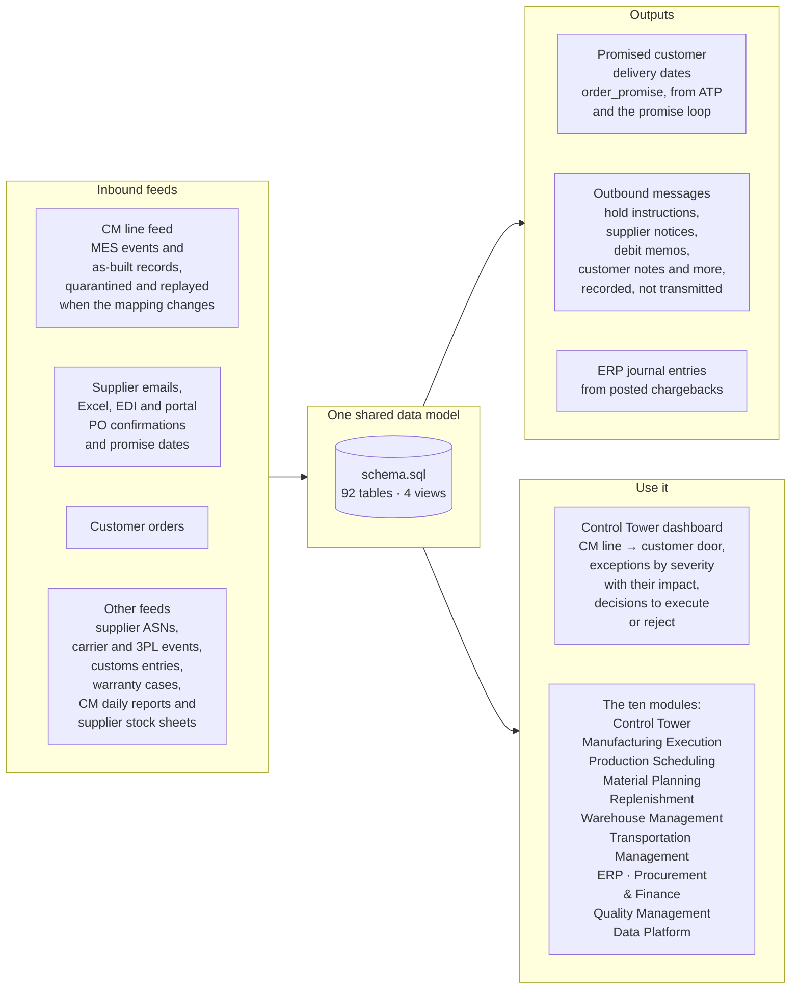
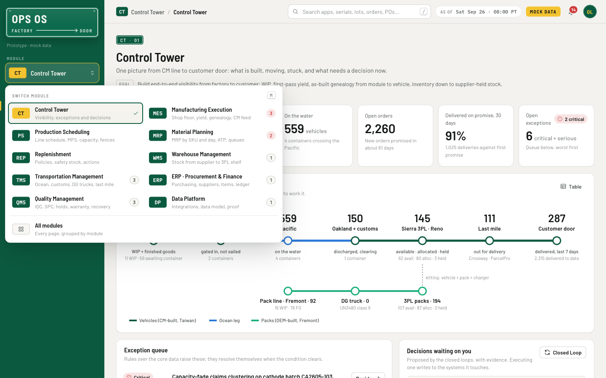
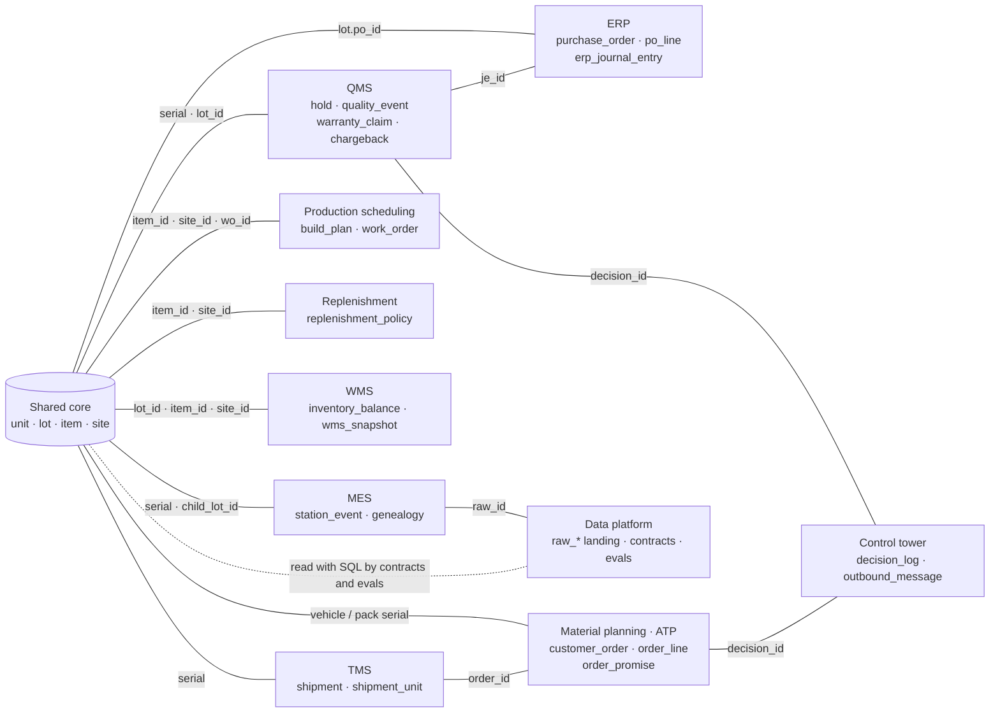
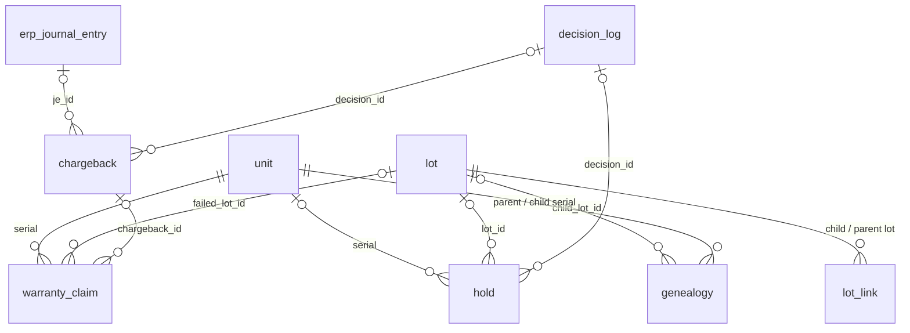
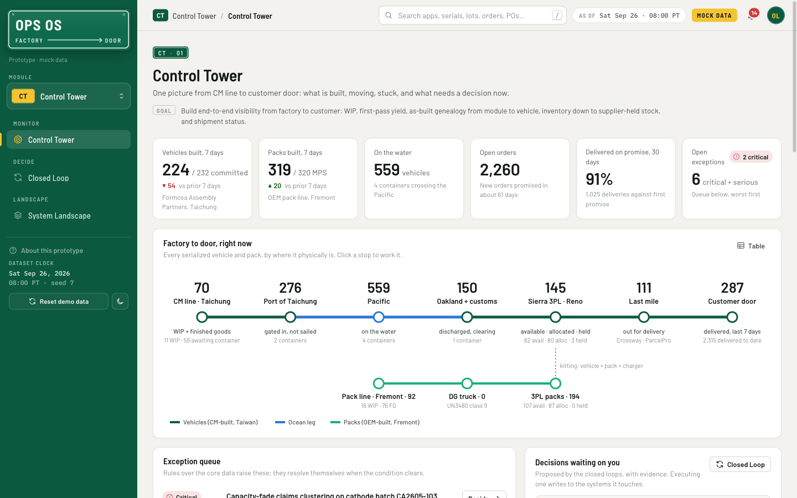

# Ops OS: operations systems prototype

**A unified operations interface prototype: toggle between QMS, replenishment, production scheduling, TMS and six
more modules in one place, all running on one shared data model.**

> This is a prototype built to explore unified operations UX. All data comes from a simulator, and every company,
> product, part number and price in it is fictional.

### How it stays one source of truth

- **One database.** Every module reads one SQLite file: 92 tables and 4 views, defined in `ops/schema.sql`.
- **Foreign keys on every write.** All 153 are enforced on every connection; no row can point at a missing record.
- **Decisions leave a trail.** Holds, CAPAs, chargebacks, promises, messages and change reviews carry the
  `decision_log` ID of the decision that wrote them, and each decision records a summary of all it wrote.
- **Messages are the hand-off.** Instructions for outside systems (warehouse, MES, suppliers, ERP, customers) are
  recorded in `outbound_message`; the prototype doesn't send them.
- **Contracts re-run after every change.** Executing a decision, releasing a hold, each chargeback step and an MRP
  re-run all re-run the 21 data contracts, so violations surface where they can be fixed.

**The database is the truth: modules are views, feeds are inputs, messages are outputs.**

**The code is laid out the same way: a folder for each stage the data passes through, and a header on each module
saying what it holds.**

```
app.py           start here: builds the database if it is missing, then serves the app
ops/
  schema.sql     every table, view, index and foreign key (defined nowhere else)
  db.py          the app's database connections, query helpers and the dataset's clock
  generate/      the simulator: a mock world and the raw feeds its outside systems send
  ingest/        feed loaders: raw payloads in, the shared core out
  logic/         the rules: planning, parts tracing, decisions, data contracts, evals
  api/           the HTTP server; routes/ holds the JSON API, one file per page area
web/
  js/pages/      one file per page, 24 in all
  js/lib/        code the pages share: markup, API calls, formatting, components, charts, icons
  css/app.css    the design system
tests/           unit, integration and end-to-end tests
docs/            walkthrough, code conventions, design system, screenshots
data/            the generated database (not in git)
```

- **Folders follow the data.** Feeds enter through `ingest/`; the data is planned, checked and acted on in `logic/`,
  served by `api/` and drawn in `web/`. To trace a number on screen back to its feed, open the folders in reverse.
- **Adding a page is local.** A page is one file in `web/js/pages/` plus its entries in `PAGES` and `MODULES` in
  `web/js/app.js`, and any API it calls lives in `ops/api/routes/`. Nothing else needs registering: the server loads
  every route file at startup, and the shell won't start if the menu and the pages disagree.
- **Files open with a header** that says what they hold: all 76 non-empty Python modules, all 31 JavaScript files, the
  stylesheet and `schema.sql`. Inside, comments give the reason where the code alone doesn't.
- **The headers are an index for reuse.** Before writing a new function, a person or an AI assistant can read the
  headers to find the module that already does the job, and extend it instead of writing a second copy.
  `docs/CONVENTIONS.md` lists the shared helpers and the pattern every route and page follows.





Pick a module in the sidebar switcher (or press `M`), and the menu shows that module's pages. Search finds any page,
serial number, lot, order or PO.

### The data model

Everything lives in one SQLite database: 92 tables and 4 views, with 153 foreign keys enforced on every write. There
are two views of it below, and every solid line in both is a real foreign key. Click a view's title to open or close it.

<details open>
<summary><b>System view</b>: which module owns which records, and how they join</summary>



Each box is a module and the main tables it owns. Each solid line is a foreign key between their tables, labeled
with the join columns. Eight modules attach directly to the same core: serial numbers (`unit`), lots,
items and sites. The other links cross between modules: a chargeback posts to an ERP journal entry, holds and new
promises point back to the Control Tower decision that made them, a shipment points to its customer order, and a
station event points to the raw CM message it came from. The dotted line isn't a foreign key: contracts and evals
read the tables through SQL.

</details>

<details>
<summary><b>Process view</b>: the recall process, table by table</summary>



A warranty claim names the vehicle and the failed cell lot. `lot_link` climbs from that lot to the batch it was made
from and back down to its sibling lots, and `genealogy` fans out to every pack and vehicle built from them. The
containment decision places the holds and drafts the chargeback. The claims are billed on that chargeback, and posting
it creates the ERP journal entry. This is the walkthrough's story; the app's Data Sandbox shows the full model.

</details>

### How we prove it works

Each kind of check records its runs in a table, so the evidence can be queried in the Data Sandbox like any other
data. The Tests · Evals · Review page shows the latest results and their history.

| Check | What it proves | Sandbox table · columns |
|---|---|---|
| **82 tests** | The logic gives the numbers worked out by hand (MRP netting, ATP allocation, parsers, recovery math), and every closed loop closes end to end. | `test_run` · tests, failures, errors, duration_s, detail_json |
| **6 evals** | Each model's output is scored against the known answer on realistic volume. Below its threshold, the gate fails. | `eval_suite` · metric, threshold<br>`eval_run` · subject_version, score, gate<br>`eval_case` · expected, actual, passed |
| **21 contracts** | Rules the data must always obey, written as SQL that returns the violating rows. They re-run after each decision, hold release, chargeback step and MRP run. | `data_contract` · check_sql, severity<br>`contract_run` · violations, sample_json |
| **Change review** | A mapping change is marked deployed only if its tests, evals and contract pass, and the approver is recorded. | `change_review` · test_run_id, eval_run_id, contracts_ok, reviewer, status |

**Regression.** Runs are appended, never overwritten, so a falling eval score shows as a trend on the Tests · Evals ·
Review page, and below its threshold the gate fails (`eval_run.gate`). When an eval caught a parser bug (a ship date
read as a delivery date), the fix got its own test in `tests/test_parsers.py`. The suite also runs on other dataset
dates (`OPS_TEST_AS_OF`), and one test rebuilds the world to check that the same seed gives the same data. Nothing yet
compares a run with the one before it, so a score that falls but stays above its threshold still passes. More in
[Tests and evals](#tests-and-evals).

### How we measure the value

Time and money are measured from tables you can open in the Data Sandbox: time from event timestamps, money from the
records that move it. The estimates behind the numbers, such as vendor prices and the effort of each integration
option, are stored as data too, so they can be checked.

| Measure | How it's computed, and where it shows | Sandbox table · columns | In the walkthrough's data |
|---|---|---|---|
| **Time a process takes** | The time between two events is charged to the later step, and each step is classed as value, control, glue or wait. Deleting the glue and wait steps gives a projected cycle time. **Process Lab** | `process_event` · case_id, activity, ts, actor_role<br>`process_activity` · category | PO confirmation: 73% of elapsed time is glue or waiting. Deleting it would cut the median cycle of the 60 cases that touch it from 9.1 days to 32.7 hours. |
| **Manual work** | Human touches per case, and per week for each way of integrating a system. **Process Lab, Integration Hub** | `process_event` · actor_role<br>`integration_option` · touches_per_week, latency_minutes, error_rate_pct, run_usd_month | 7 manual touches a week, down from 59 when buyers re-keyed supplier emails. |
| **Money recovered** | Chargebacks are priced from claims and quality events under each supplier's terms, and count as recovered once posted to the ERP as debit memos. **Warranty & Chargebacks, ERP Core** | `chargeback` · amount_usd, status<br>`erp_journal_line` · debit_usd, credit_usd | $4,344.00 posted, $7,494.80 more sent or disputed, and D-0105 proposes $9,652.30. |
| **Impact before a decision** | Each proposed decision states its expected impact before anyone approves it, and exceptions can carry theirs in units and dollars. **Closed Loop, Control Tower** | `decision_log` · impact_json<br>`ops_exception` · impact_units, impact_unit, impact_usd | D-0106: $2,825 of air freight protects 192 packs and 1,636 promises that would otherwise slip. |
| **Software spend** | Thin-app telemetry turns real usage into capability weights, and every vendor is re-scored on them instead of on assumed weights. It also shows time on task per feature. **Buy vs Build** | `app_telemetry` · feature, duration_s, outcome<br>`capability` · assumed_weight<br>`vendor` · annual_usd, impl_weeks<br>`vendor_capability` · fit | The ranking flips in all 3 domains: $304K a year and 49 implementation weeks avoided. |

**Value is stated before a decision, booked when money moves, and measured from usage before software is bought.**

## Systems

| Module | What it does | Data it reads and writes | Deadlines it tracks |
|---|---|---|---|
| **Control Tower** | One picture from the CM line to the customer's door, exceptions ranked by severity with their impact, the four closed loops you can execute or reject, and a list of every connected system. | **Reads** `ops_exception`, `decision_log`, `unit`, `shipment`, `customer_order` and every feed's `raw_*` status (52 tables).<br>**Writes**, when you execute a decision: `decision_log`, `hold`, `unit`, `outbound_message`, `chargeback`, `order_promise`, `po_line`, `deviation`, `change_review`, replayed `station_event` and `genealogy`, and an MRP re-run (31 tables). | Customer promise dates: on-time delivery against the first promise, and promises at risk |
| **Manufacturing Execution (MES)** | Work in progress, first-pass yield and defects by station, the as-built parts tree of any serial, and the CM's data feed with its mappings and quarantine. | **Reads** `station_event`, `genealogy`, `lot_link`, `raw_cm_mes_event`, `mapping_version`, `downtime_event` (34 tables).<br>**Writes** nothing. The feed loaders write this data. | Each production day's build plan, and work orders' scheduled dates |
| **Production Scheduling** | Each line's daily plan against rated capacity and time fences, the master production schedule, and the next shift's build sequence. | **Reads** `build_plan`, `work_order`, `line_capacity`, `time_fence`, `downtime_event`, `demand_forecast` (18 tables).<br>**Writes** nothing. | Build-plan dates inside frozen and slushy time fences, and the next shift's end time |
| **Material Planning (MRP)** | Multi-level MRP by part and by day, and available-to-promise: the date a new order can be promised. | **Reads** `bom_line`, `inventory_balance`, `po_line`, `build_plan`, `customer_order`, `replenishment_policy` (24 tables).<br>**Writes** `mrp_run` and `mrp_message` when you re-run MRP. The ATP check writes nothing. | PO need dates against supplier promise dates, and customers' requested and promised dates |
| **Replenishment** | The restocking policy for each part at each site (MRP, reorder point, min-max, DRP, VMI, consignment), with its safety stock and stock position. | **Reads** `replenishment_policy`, `inventory_balance`, `unit` (units on hold don't count), `po_line`, `cm_stock_report` (21 tables).<br>**Writes** nothing. | Supplier lead times, the next receipt date, and days of cover against safety stock |
| **Warehouse Management (WMS)** | Inventory everywhere it sits, from supplier stock to the 3PL shelf, checked against the 3PL's own count. | **Reads** `inventory_balance`, `unit`, `wms_snapshot`, `cm_stock_report`, `hold` (21 tables).<br>**Writes** nothing. | ETAs of stock in transit, and the as-of date of each stock report |
| **Transportation Management (TMS)** | Ocean shipments, customs filings, dangerous-goods trucking for battery packs, last-mile delivery and freight spend. | **Reads** `shipment`, `shipment_event`, `shipment_unit`, `customs_entry`, `carrier`, `freight_rate` (14 tables).<br>**Writes** nothing. | Planned and current ETDs and ETAs, the ISF cutoff 24 hours before loading, and last-mile delivery against the promise date |
| **ERP · Procurement & Finance** | Purchase orders and supplier promise dates, forecasts released to suppliers, RFQs and engineering changes, costed BOMs, three-way match and the general ledger. | **Reads** `purchase_order`, `po_line`, `po_promise_history`, `price`, `forecast_line`, `rfq_quote`, `supplier_invoice`, `erp_journal_entry` (33 tables).<br>**Writes** nothing. Journal entries come from QMS's *Post to ERP*. | PO need and supplier promise dates, invoice due dates, ECO effective dates and price effectivity windows |
| **Quality Management (QMS)** | Incoming inspection, SPC, deviations, NCRs and CAPA, holds, and warranty claims traced to a lot and charged back to the supplier. | **Reads** `quality_event`, `hold`, `deviation`, `capa`, `control_plan`, `warranty_claim`, `chargeback` (24 tables).<br>**Writes** `hold`, `unit` and `outbound_message` when you release a hold, and `chargeback`, `chargeback_line`, `warranty_claim`, `decision_log`, `outbound_message`, `erp_journal_entry` and `erp_journal_line` as a chargeback is drafted, sent, accepted and posted. | Deviation expiry dates and a chargeback's supplier response due date; holds show when they were placed |
| **Data Platform** | Every inbound feed step by step (email and Excel included), the data model with read-only SQL, data contracts and reconciliations, tests and evals, process mining, and a buy-vs-build scorecard. | **Reads** every `raw_*` table, `ingest_step`, `data_contract`, `contract_run`, `eval_run`, `test_run` and `process_event` (53 tables), plus any table through read-only SQL.<br>**Writes** `data_contract`, `contract_run`, `eval_run`, `eval_case` and `test_run` when you run contracts, evals or tests. The SQL console and the parser tester write nothing. | Contract time limits: 24 hours in quarantine, 72 hours to confirm a PO line, ISF 24 hours before loading |

The reads and writes come from a trace of the SQL that each module's pages and actions run. Actions that change
operational data (executing a decision, releasing a hold, each chargeback step, re-running MRP) then re-run the 21 data
contracts; executing or proposing decisions and re-running MRP also re-check the exception rules. How the logic is
checked: [tests, evals and data contracts](#tests-and-evals).

---

## The problem

Operations systems live in silos. The MES knows what was built, the QMS knows what failed, the ERP knows what was
paid, the TMS knows what is on the water, and planning lives in spreadsheets. People bridge the gaps by email and
Excel, so when a defect shows up in the field it takes days to find the units still on the shelf, the supplier that
caused it and the customers who will feel it.

Ops OS explores one view across that chain: suppliers, a contract manufacturer's line, a battery-pack line, ocean
freight, a 3PL and the customer. Every module reads the same data, so a problem found in one becomes a decision the
others see. A quality hold takes units out of available stock, a supplier chargeback posts to the ledger, and a new
delivery date is queued as a note to the customer.



## Run it locally

You need Python 3.9 or newer. The app uses only the standard library: nothing to install, no build step. It is
tested on macOS with Python 3.9 and 3.12.

```bash
git clone https://github.com/chris-supply-chain/ops-systems-prototype.git
cd ops-systems-prototype
python3 app.py
```

The first run builds the mock database (about 5 seconds, about 57 MB in `data/`), then serves
<http://localhost:8000> and opens it in your browser. `Ctrl+C` stops it. On Windows, Python has no time-zone
database, so install it first: `py -m pip install tzdata`, then `py app.py`.

| To do this | Run |
|---|---|
| Rebuild the exact dataset the walkthrough uses | `python3 app.py --reset --as-of 2026-09-26` |
| Serve on another port, without opening a browser | `python3 app.py --port 8001 --no-browser` |
| Run the test suite | `python3 -m unittest discover -s tests` |

Without `--as-of`, the database is dated today. The storylines play out on any date, but the walkthrough's numbers
are for 2026-09-26. The sidebar's **Reset demo data** rebuilds the database with its current date and seed.

## A ten-minute tour

[docs/WALKTHROUGH.md](docs/WALKTHROUGH.md) follows one story across the modules, with the numbers you will see at
each step:

1. **Control Tower.** Warranty claims are clustering on one batch of battery material.
2. **Genealogy.** Trace the batch forward: 203 affected units are still in our hands, and 1,303 are with customers.
3. **Closed Loop.** Execute the containment. It places 295 holds and sends hold instructions to the warehouse and
   the pack line.
4. **Warranty.** The claims become a $9,652.30 chargeback to the cell supplier.
5. **ERP.** The accepted chargeback posts a balanced entry to the ledger.
6. **Data Sandbox.** One SQL query shows every decision and every row it wrote.
7. **CM Feed.** The contract manufacturer changed its data format without notice. Bad messages were quarantined and
   replayed under a new mapping, and nothing was lost.
8. **Material Plan.** A late part would stop the pack line on a specific day, and the plan pulls in supply to prevent it.
9. **ATP.** A delayed ship moves 382 customer delivery dates in one action and queues a note to each customer.
10. **Tests · Evals · Review.** How every rule is checked before it runs.

## How it works

```
partner systems ──▶  LANDING    every message stored exactly as received
                        │       normalizers: versioned mappings, quarantine and replay
                        ▼
                     CORE       one relational model, foreign keys enforced (92 tables, 4 views)
                        │       planning (MRP, ATP), parts tracing, exception rules
                        ▼
                     ACTION     decisions, plus every row each decision writes
                        │       holds, expedites, debit memos, new delivery dates
                        ▼
                     back to the systems that must act (as queued messages)

ASSURANCE: tests, evals, data contracts and change reviews
```

- **One database.** All ten modules read the same SQLite file. Only actions write to it: executing a decision,
  releasing a hold, moving a chargeback along, re-running MRP, or running contracts, evals or tests.
- **Closed loops.** Four loops (quality, supply, promise, data) turn a detected problem into a proposed decision with
  its evidence. Executing one writes real rows and outbound messages. The holds, chargebacks, promises and messages it
  writes carry its ID, and the decision records a summary of what it wrote. The outbound messages are the hand-off to
  other systems; in this prototype they are recorded and shown, not sent.
- **A simulated world.** A deterministic simulator generates about a year of operations: a contract manufacturer in
  Taiwan, a pack line in California, weekly ocean sailings, a 3PL in Nevada and 25 suppliers across three tiers. It
  plants problems for the loops to find. The same seed always gives the same data, and a test enforces it.

## Contract spec

**How contracts work.** The 21 data contracts live in `ops/logic/contracts.py`. Each one is a SQL query that returns
the rows breaking a rule; zero rows is a pass. They run when the database is built, after every action that changes
operational data (executing a decision, releasing a hold, each chargeback step, re-running MRP), and on demand from
the Contracts and Tests pages. Every run is stored in `contract_run`. They detect problems but don't block the write,
so a bad row still lands where it can be seen and fixed. The one place a contract gates anything is decision D-0107:
its mapping change is recorded as deployed only if C-GEN-05 is clean, along with the unit tests and two evals.

**What the schema enforces at write time.** Separately from the contracts, the schema rejects bad writes outright:
153 foreign keys, CHECK constraints (allowed statuses, positive quantities, and a genealogy row naming exactly one
child: a serial or a lot), unique keys, and one partial unique index that allows a single current copy of each
genealogy link, so a feed that sends the same fact twice can't double count it.

**The contracts.** "Canonical data" is the violation count in the walkthrough's dataset, where nine contracts fail on
purpose as the problems the loops and pages are built to show.

| Contract | Producer → consumer | Records checked | If it's violated | Canonical data |
|---|---|---|---|---|
| **C-GEN-01** Every built vehicle has a complete as-built record | CM feed loader → recall trace, warranty attribution | frame, drive unit, pedal unit and HMI `genealogy` links for each built `unit` | A recall or a warranty claim can't see a part that was installed | 0 |
| **C-GEN-02** Installed drive units carry supplier sub-genealogy | Supplier ASN loader → recall trace | motor and controller `genealogy` links under each installed drive unit | A motor or magnet-lot recall misses those vehicles | 18: drive units that arrived without an ASN |
| **C-GEN-03** No part is in two places at once | Every genealogy writer (CM feed, ASN, pack line, 3PL kitting, service swaps) → recall trace | current `genealogy` parents per `child_serial` | One part counts in two vehicles, and recall scope is wrong | 0 |
| **C-GEN-04** Every pack at or past the 3PL traces to a BMS and a cell lot | Pack-line MES → battery recall | pack `unit` status against its BMS and cell-lot `genealogy` links | A battery recall can't be scoped by lot | 0 |
| **C-GEN-05** End-of-line drive-unit read matches the as-built record | CM feed (S60 test `measurements.du_sn`) → as-built record; gate for D-0107 | latest passing S60 `station_event` against the current drive-unit link | The as-built record names the wrong drive unit | 3: swaps in the unmapped S65 rework bay |
| **C-GEN-06** A serialized slot holds one part at a time | Every genealogy writer → recall trace | current `genealogy` links per parent and position | A removal was never recorded, so which part is installed is unknown | 0 |
| **C-FEED-01** No CM message sits in quarantine for more than 24 hours | CM feed normalizer → production, genealogy | `raw_cm_mes_event` rows quarantined for over 24 hours | Station history and as-built stay incomplete until the messages are replayed | 7: messages from station S65 |
| **C-FEED-02** Every landed message reached a terminal state | All loaders → Integration Hub | `PENDING` rows in five `raw_*` tables | A message landed and was never processed | 0 |
| **C-SRC-01** PO lines are confirmed within 72 hours | Supplier confirmations (EDI, portal, email, Excel) → MRP | open `po_line` rows still unconfirmed 72 hours after the PO | MRP plans on the need date and can't see a slip | 4 |
| **C-SRC-02** Price effectivity windows never overlap | Price list → PO pricing, cost | overlapping `price` rows for one item, supplier and price break | Two contract prices apply on the same date | 0 |
| **C-SRC-03** PO prices equal the contract price on the PO date | PO creation → invoice match, cost | `po_line.unit_price` against the effective `price` | Overpayment; the check reports the dollars | 3: lines at a superseded price |
| **C-MOV-01** Every unit on a received container's ASN was received | CM ASN and 3PL receipt → inventory | units on a received CM-to-3PL `shipment_unit` still in transit | Units shipped on paper never arrived | 4: serials that never left the CM |
| **C-MOV-02** ISF is filed at least 24 hours before vessel loading | Customs broker and carrier events → customs | `customs_entry.isf_filed_at` against the `LOADED` `shipment_event` | A penalty per filing and holds at discharge | 1 |
| **C-QUA-01** Nothing on an active hold leaves for a customer | Holds (QMS, closed loop) and 3PL shipping → containment | active `hold` rows against 3PL-to-customer `shipment` departures | Containment failed: a held unit reached a customer | 0 |
| **C-QUA-02** Deviations are used within their quantity and dates | QMS deviations → MRP alternate parts, pack line | `deviation` quantity used and validity | A deviation used past its limits | 0 |
| **C-QUA-03** Use-up parts are only installed while their deviation is valid | Pack-line installs (`genealogy`) against QMS `deviation` | installs of phase-out parts after `valid_to` | Unauthorized installs | 1: 473 gaskets after the deviation expired |
| **C-FIN-01** Posted chargebacks have a balanced journal entry equal to the amount | Chargeback *Post to ERP* → general ledger | `chargeback` amount against `erp_journal_line` debits and credits | Recovered money isn't in the ledger to the cent | 0 |
| **C-FIN-02** A chargeback equals the sum of its lines | Chargeback drafting → supplier notice, ERP | `chargeback.amount_usd` against its `chargeback_line` rows | Header and lines disagree | 0 |
| **C-FIN-03** Suppliers are billed only for diagnosed warranty claims | Warranty claims → chargeback lines | claims on a `chargeback_line` whose status isn't diagnosed, repaired or closed | A charge the supplier will rightly dispute | 0 |
| **C-PLN-01** Every open order carries a promise date | Promise engine → customer | `customer_order.promised_date` on open orders | A customer waits without a date | 0 |
| **C-INV-01** The 3PL's WMS count equals our serialized count by SKU | 3PL inventory snapshots and our unit statuses → inventory, ATP | latest `wms_snapshot` against `unit` rows at the 3PL | ATP can allocate units the warehouse doesn't have | 1: a unit that missed a scan |

**Implied but not enforced.** These hold in the generated data, but nothing checks them at runtime:

- **Kit pairing.** The 3PL loader writes an order line's vehicle and pack serials (`order_line`) and the kit link in
  `genealogy` together. No contract checks that the two still agree.
- **Installed lot quantity equals the BOM quantity** (40 cells per standard pack, 2 tires per vehicle). A test checks
  it on generated data; no runtime contract does.
- **Row keys.** Where a table's primary key is only a row number, the Sandbox declares which columns make a row
  unique. Tests check those keys on generated data, but the database enforces only genealogy's.
- **Outbound messages** (hold instructions to the WMS and MES, supplier notices, debit memos, customer notes) are
  stored as JSON in `outbound_message` with no schema check, and no system consumes them.
- **Inbound message shapes.** The CM normalizer checks each message against a versioned mapping and quarantines what
  doesn't fit. That check is code, not a contract; C-FEED-01 only watches how long quarantine lasts.
- **Promise achievability.** C-PLN-01 checks that a promise exists, not that it can still be kept. Promises at risk
  are found by an exception rule (`PROMISE-AT-RISK`), which is what proposes a re-promise.
- **Reconciliations.** Three of the six reconciliations on the Recon page (CM daily report against MES events, CM
  consigned-stock report against our serials, supplier invoices against PO and contract price) have no contract
  behind them. They show differences on the page, and nothing re-checks them after an action.

## Tests and evals

The logic is checked three ways, and each catches something the others don't:

- **Tests check the code.** There are 82 `unittest` tests. Unit tests run on tiny hand-built databases with
  hand-computed expectations: MRP netting, ATP allocation, genealogy traces, parsers and recovery math. End-to-end
  tests build the whole simulated world, check its invariants (foreign keys, balanced inventory flows, canonical
  timestamps, same seed gives the same data, row keys), then execute all four decisions on a copy and check that each
  loop closes.
- **Evals check the output against a known answer.** An eval runs a piece of logic on realistic volume and scores
  what it produced against the truth, with a pass threshold. The simulator knows what physically happened, so the CM
  feed normalizer and the recall trace are graded against ground truth, not just checked for running.
- **Contracts check the live data** after every action (see [Contract spec](#contract-spec)).

| Eval | What it scores | Scored against | Pass threshold |
|---|---|---|---|
| EV-CM-MES | The CM feed normalizer: each vehicle's station history and as-built record | Simulator ground truth | Exact-match rate ≥ 99.5% |
| EV-GENEALOGY | The recall trace: the units affected by a cell lot or a drive unit | Simulator ground truth | Set-exact rate = 100% |
| EV-WARRANTY-CLS | The free-text warranty symptom classifier | Labeled set | Accuracy ≥ 90% |
| EV-PROMISE-PARSE | Promise dates parsed from supplier emails and Excel files | Labeled set | Precision = 100%; the parser abstains when unsure, and coverage must stay ≥ 80% |
| EV-ATP-BACKTEST | First promise against actual delivery, last 60 days | Backtest | On-time rate ≥ 85% |
| EV-MRP-TEXTBOOK | MRP netting | Hand-computed textbook cases | Exact-match rate = 100% |

In the canonical data, EV-CM-MES (98.8%) and EV-GENEALOGY (83.8%) fail on purpose, because the CM's new S65 rework
bay isn't mapped yet. They are two of D-0107's gates. Executing it maps the station and replays the quarantined
messages, and both reach 100%. Every run is stored (`eval_run`, `eval_case`), and the Tests · Evals · Review page shows
the trend and each failing case. The same harness is how a replacement would be judged: an LLM symptom classifier,
for example, would have to beat the rules classifier's score on the same labeled set.

Rule and mapping changes carry a change-review record with their gates (tests, evals, contracts, reviewer). D-0107
creates one and records it as deployed only if its gates pass; the other records are seeded history.

```bash
python3 -m unittest discover -s tests                        # the full suite, about 15 seconds
python3 -m ops.proof                                         # the same suite, recorded for the Tests page
OPS_TEST_AS_OF=2027-03-03 python3 -m ops.proof --no-record   # the whole story on another dataset date
```

The suite passes on dataset dates across 2026 and early 2027, and on Python 3.9 and 3.12.

## Tech stack

- **Backend:** Python 3.9+ standard library only (`http.server`, `sqlite3`), with a JSON API of 103 routes.
- **Database:** SQLite, one file with 92 tables and 4 views.
- **Frontend:** plain JavaScript ES modules and CSS, with no framework and no build step. Web fonts load from Google
  Fonts, and the page falls back to system fonts offline.
- **Data:** a deterministic simulator that also produces the raw inputs: CM MES messages (JSON), X12 855 supplier
  acknowledgments, pipe-delimited carrier events, RFC 822 emails and Excel files.
- **Tests:** Python `unittest`, including end-to-end runs of every closed loop.

## Status

This is a prototype built to explore unified operations UX, not production software. It runs locally for one user
with no authentication, and every number in it comes from the simulator.
